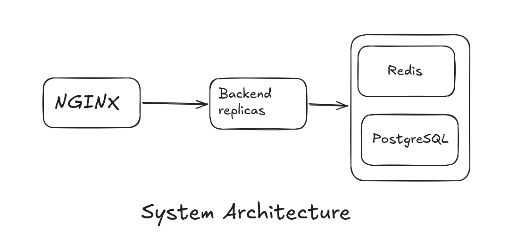

# ScaleGuard Auth API
A high-performance, distributed backend with JWT authentication and multilayered atomic rate-limiting.

## Key Highlights
 - Containerization: Orchestrated 4 services (FastAPI, Redis, PostgreSQL, Nginx) using Docker Compose for good portability.
 - Database Management: Handled schema evolution with Alembic migrations and SQLAlchemy ORM, also used SQLAlchemy for user schema design.
 - Stateless Authentication: Secure user sessions using JWT (JSON Web Tokens).
 - Load Balancing and IP-based rate limiting : Configured Nginx as a reverse proxy to distribute traffic and implement IP-based rate limiting.
 - Distributed Rate Limiting: Implemented the Token Bucket Algorithm using Redis and Lua scripting for atomicity across multiple backend replicas.

## System architecture

