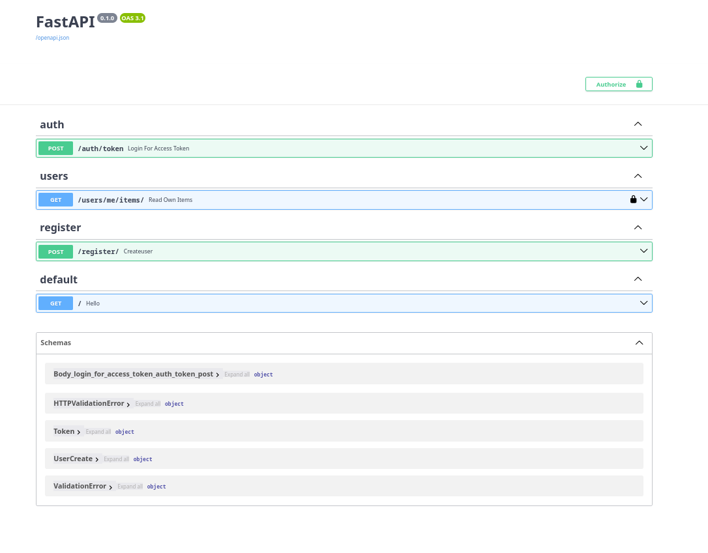
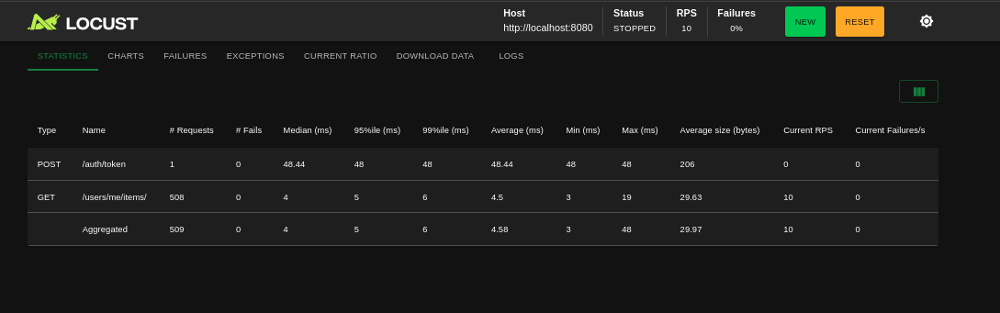

# ScaleGuard: Distributed Auth & Rate-Limiting System

**ScaleGuard** is an enterprise-grade API architecture designed for high availability and strict traffic control. It features a multi-replica FastAPI backend, atomic distributed rate-limiting using Redis Lua scripts, and an Nginx load balancer.

---

## Key Highlights

* **Distributed Rate Limiting:** Engineered a custom **Token Bucket** provider using **Redis & Lua scripting** to ensure atomic operations across multiple backend replicas, preventing race conditions.
* **High Availability & Load Balancing:** Configured **Nginx** as a reverse proxy and load balancer to distribute traffic across backend services while enforcing **IP-based rate limits** at the edge.
* **Orchestrated Micro-services:** Fully containerized environment using **Docker Compose**, managing 4 distinct services (FastAPI, Redis, PostgreSQL, Nginx) for seamless "one-click" deployment.
* **Stateless Authentication:** Implemented secure, scalable user sessions using **JWT (JSON Web Tokens)** with industry-standard OAuth2 password flow.
* **Automated Migrations:** Managed complex schema evolution and relational mapping using **Alembic** and **SQLAlchemy ORM**.

---

## System Architecture

The system is designed to handle distributed traffic. Requests hit the Nginx edge, which performs initial rate-limiting before load-balancing to one of the FastAPI replicas. Each replica communicates with a central Redis cluster for real-time, atomic rate-limit checks.


---

## Tech Stack

* **Backend:** Python 3.10+, FastAPI
* **Data Persistence:** PostgreSQL
* **Caching & Coordination:** Redis
* **Infrastructure:** Docker & Docker Compose
* **Reverse Proxy/LB:** Nginx
* **Database Migrations:** Alembic

---

## Technical Deep Dive: Why this Architecture?

### 1. Atomic Token Bucket (Redis + Lua)
Standard Python logic for rate-limiting is prone to **Race Conditions** in distributed environments. I implemented the logic in **Lua** so that the "Read-Update-Write" cycle happens as a single atomic operation within Redis, ensuring 100% accuracy regardless of the number of replicas.

### 2. Multi-Replica Scaling
By scaling the FastAPI service to multiple containers, the system demonstrates how a shared Redis state allows rate-limiting to be consistent across the entire cluster, not just a single node.

### 3. Layered Defense
Traffic is filtered twice:
1. **Nginx Layer:** Protects against DDoS/Brute-force by limiting requests per IP at the infrastructure level.
2. **Application Layer:** Enforces granular, user-ID based limits to prevent API abuse at the business logic level.

---

## Getting Started

Ensure you have **Docker** and **Docker Compose** installed.

```bash
# Clone the repository
git clone [https://github.com/manit989/scaleguard-api.git](https://github.com/manit989/scaleguard-api.git)

# Navigate to the project directory
cd scaleguard-api

# Spin up all services (Nginx, API Replicas, DB, Redis)
docker-compose up --build
```

## Documentation and Testing
 - Documentation is available at /docs on swagger
 - Testing was done use locust

### Images

#### docs




#### Testing



